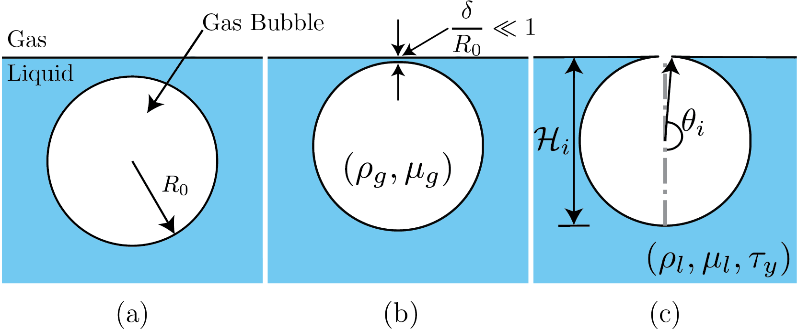
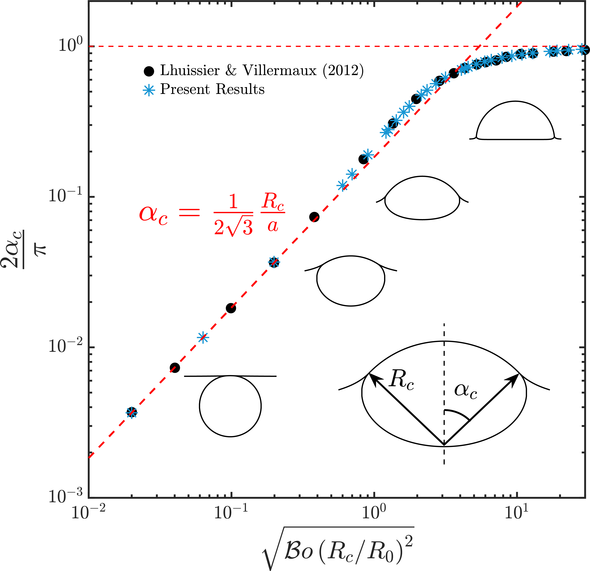

---
header-includes:
  - \usepackage{fancyvrb}
  - \usepackage{verbatim}
  - \usepackage{fvextra}
  - \makeatletter
  - \def\verbatim@font{\scriptsize\ttfamily}
  - \makeatother
  - \makeatletter
  - \fvset{numbers=left, frame=single, framerule=0.5mm, breaklines=true}
  - \hypersetup{colorlinks}
---
[](https://arxiv.org/abs/2101.07744)
# Bursting Bubble in a Viscoplastic Medium

[](https://zenodo.org/badge/latestdoi/310680647)

This repository contains the codes used for simulating the cases discussed in the manuscript: Bursting bubble in a viscoplastic medium. The results presented here are currently under review in Journal of Fluid Mechanics.

The supplementary videos are available [here](https://youtube.com/playlist?list=PLf5C5HCrvhLFETl6iaRr21pzr5Xab1OCM)

# Introduction:
We investigate the classical problem of bubble bursting at a liquid-gas interface, but now in the presence of a viscoplastic liquid medium. Here are the schematics of the problem. This simualtion will start from Figure 1(c). 
<!-- <p align="center">
  
  <caption><p align="center">Schematics for the process of a bursting bubble: (a) A gas bubble in bulk. (b) The bubble approaches the free surface forming a liquid film (thickness $\delta$) between itself and the free surface. (c) A bubble cavity forms when the thin liquid film disappears.</caption>
</p> -->

**Figure**: Schematics for the process of a bursting bubble: (a) A gas bubble in bulk. (b) The bubble approaches the free surface forming a liquid film (thickness $\delta$) between itself and the free surface. (c) A bubble cavity forms when the thin liquid film disappears.

## Prerequisite

You need to install [Basilisk C](http://basilisk.fr). Follow the installation steps [here](http://basilisk.fr/src/INSTALL). In case of compatibility issues, please feel free to contact me: [vatsalsanjay@gmail.com](mailto:vatsalsanjay@gmail.com). For post-processing codes, Python 3.X is required. 

## LaTeX rendering in documentaion

Github does not support native LaTeX rendering. So, you only see raw equations in this README file. To have a better understanding of the equations, please see [README.pdf](README.pdf) or visit my Basilisk [Sandbox](http://basilisk.fr/sandbox/vatsal/README).

# Numerical code
Id 1 is for the Viscoplastic liquid pool, and Id 2 is Newtonian gas.

```c
#include "axi.h"
#include "navier-stokes/centered.h"
#define FILTERED // Smear density and viscosity jumps
```

To model Viscoplastic liquids, we use a modified version of [two-phase.h](http://basilisk.fr/src/two-phase.h). [two-phaseAxiVP.h](two-phaseAxiVP.h) contains these modifications.
```c
#include "two-phaseAxiVP.h"
```

You can use: conserving.h as well. Even without it, I was still able to conserve the total energy (also momentum?) of the system if I adapt based on curvature and vorticity/deformation tensor norm (see the adapt even). I had to smear the density and viscosity anyhow because of the sharp ratios in liquid (Bingham) and the gas.

```c
#include "navier-stokes/conserving.h"
#include "tension.h"
#include "reduced.h"
#include "distance.h"
```

We use a modified adapt-wavelet algorithm available [(here)](http://basilisk.fr/sandbox/pairetti/bag_mode/adapt_wavelet_limited.h). It is written by *César Pairetti* (Thanks :)).
```c
#include "adapt_wavelet_limited.h"

#define tsnap (0.001)
// Error tolerancs
#define fErr (1e-3)                                 // error tolerance in f1 VOF
#define KErr (1e-4)                                 // error tolerance in f2 VOF
#define VelErr (1e-2)                               // error tolerances in velocity
#define OmegaErr (1e-3)                             // error tolerances in vorticity

// Numbers!
#define RHO21 (1e-3)
#define MU21 (2e-2)
#define Ldomain 8

// boundary conditions
u.n[right] = neumann(0.);
p[right] = dirichlet(0.);

int MAXlevel;
double Oh, Bond, tmax;
char nameOut[80], dumpFile[80];
```

We consider the burst of a small axisymmetric bubble at a surface of an incompressible Bingham fluid. To nondimensionalise the governing equations, we use the initial bubble radius $R_0$, and inertia-capillary velocity $V_\gamma = \sqrt{\gamma/(\rho_lR_0)}$, respectively. Pressure and stresses are scaled with the characteristic capillary pressure, $\gamma/R_0$. The dimensionless equations for mass and momentum conservation, for the liquid phase, then read

$$
\nabla \cdot \boldsymbol{u} = 0
$$
$$
\frac{\partial\boldsymbol{u}}{\partial t} + \nabla\boldsymbol{\cdot}\left(\boldsymbol{uu}\right) = -\nabla p + \nabla\boldsymbol{\cdot}\boldsymbol{\tau} - \mathcal{B}o\,\hat{\boldsymbol{e}}_{\boldsymbol{\mathcal{Z}}},
$$


where $\boldsymbol{u}$ is the velocity vector, $t$ is time, $p$ is the pressure and $\boldsymbol{\tau}$ represents the deviatoric stress tensor. We use the regularized Bingham model with


$$
\boldsymbol{\tau} = 2\,\text{min}\left(\frac{\mathcal{J}}{2\|\boldsymbol{\mathcal{D}}\|} + \mathcal{O}h, \mathcal{O}h_\text{max}\right)\boldsymbol{\mathcal{D}}
$$


where $\|\boldsymbol{\mathcal{D}}\|$ is the second invariant of the deformation rate tensor, $\boldsymbol{\mathcal{D}}$, and $\mathcal{O}h_{max}$ is the viscous regularisation parameter. The three dimensionless numbers controlling the equations above are the capillary-Bingham number $\left(\mathcal{J}\right)$, which accounts for the competition between the capillary and yield stresses, the Ohnesorge number $\left(\mathcal{O}h\right)$ that compares the inertial-capillary to inertial-viscous time scales, and the Bond number $\left(\mathcal{B}o\right)$, which compares gravity and surface tension forces:


$$
\mathcal{J} = \frac{\tau_yR_0}{\gamma},\,\,\mathcal{O}h = \frac{\mu_l}{\sqrt{\rho_l\gamma R_0}},\,\,\mathcal{B}o = \frac{\rho_l gR_o^2}{\gamma}.
$$

Here, $\gamma$ is the liquid-gas surface tension coefficient, and $\tau_y$ and $\rho_l$ are the liquid's yield stress and density, respectively. Next, $\mu_l$ is the constant viscosity in the Bingham model. Note that in our simulations, we also solve the fluid's motion in the gas phase, using a similar set of equations (Newtonian). Hence, the further relevant non-dimensional groups in addition to those above are the ratios of density $\left(\rho_r = \rho_g/\rho_l\right)$ and viscosity $\left(\mu_r = \mu_g/\mu_l\right)$. In the present study, these ratios are kept fixed at $10^{-3}$ and $2 \times 10^{-2}$, respectively (see above). 

```c
int  main(int argc, char const *argv[]) {
  L0 = Ldomain;
  origin (-L0/2., 0.);
  init_grid (1 << 6);
  // Values taken from the terminal
  MAXlevel = atoi(argv[1]);
  tauy = atof(argv[2]);
  Bond = atof(argv[3]);
  Oh = atof(argv[4]);
  tmax = atof(argv[5]);

  // Ensure that all the variables were transferred properly from the terminal or job script.
  if (argc < 6){
    fprintf(ferr, "Lack of command line arguments. Check! Need %d more arguments\n",6-argc);
    return 1;
  }
  fprintf(ferr, "Level %d, Oh %2.1e, Tauy %4.3f, Bo %4.3f\n", MAXlevel, Oh, tauy, Bond);

  // Create a folder named intermediate where all the simulation snapshots are stored.
  char comm[80];
  sprintf (comm, "mkdir -p intermediate");
  system(comm);
  // Name of the restart file. See writingFiles event.
  sprintf (dumpFile, "dump");

  mumax = 1e8*Oh;  // The regularisation value of viscosity
  rho1 = 1., rho2 = RHO21;
  mu1 = Oh, mu2 = MU21*Oh;
  f.sigma = 1.0;
  G.x = -Bond;
  run();
}

/**
This event is specific to César's adapt_wavelet_limited.
*/
int refRegion(double x, double y, double z){
  return (y < 1.28 ? MAXlevel+2 : y < 2.56 ? MAXlevel+1 : y < 5.12 ? MAXlevel : MAXlevel-1);
}
```

## Initial Condition

The initial shape of the bubble at the liquid-gas interface can be calculated by solving the Young-Laplace equations [Lhuissier & Villermaux, 2012](https://www.cambridge.org/core/journals/journal-of-fluid-mechanics/article/bursting-bubble-aerosols/33D700585872DF6B9A50030FD7FCD0E1) and it depends on the $\mathcal{B}o$ number. 
Resources: 

* [Alex Berny's Sandbox](http://www.basilisk.fr/sandbox/aberny/bubble/bubble.c)
* [My Matlab code:](https://github.com/VatsalSy/Bursting-Bubble-In-a-Viscoplastic-Medium/blob/main/InitialCondition.m) Also see the results for different $\mathcal{B}o$ number [here](https://youtu.be/Z_vdsOW5fsg).

<p align="center">
  
  <caption><p align="center">Comparision of the initial shape calculated using the Young-Laplace equations. Ofcourse, for this study, we only need: $\mathcal{B}o = 10^{-3}$. In the figure, $a$ is the capillary length, $a = \sqrt{\gamma/(\rho_lg)}$</caption>
</p>
<!-- 
**Figure**: Comparision of the initial shape calculated using the Young-Laplace equations. Ofcourse, for this study, we only need: $\mathcal{B}o = 10^{-3}$. In the figure, $a$ is the capillary length, $a = \sqrt{\gamma/(\rho_lg)}$. -->

Since we do not focus on the influence of $\mathcal{B}o$ number in the present study, I am not elaborating on it here. For all the simulations, I use the interfacial shape calculated for $\mathcal{B}o = 10^{-3}$. The resultant data file is available [here](https://raw.githubusercontent.com/VatsalSy/Bursting-Bubble-In-a-Viscoplastic-Medium/main/Bo0.0010.dat).

**Note:** The curvature diverges at the cavity-free surface intersection. We fillet this corner to circumvent this singularity, introducing a rim with a finite curvature that connects the bubble to the free surface. We ensured that the curvature of the rim is high enough such that the subsequent dynamics are independent of its finite value.

```c
event init (t = 0) {
  if (!restore (file = dumpFile)){

    char filename[60];
    sprintf(filename,"Bo%5.4f.dat",Bond);
    FILE * fp = fopen(filename,"rb");
    if (fp == NULL){
      fprintf(ferr, "There is no file named %s\n", filename);
      return 1;
    }
    coord* InitialShape;
    InitialShape = input_xy(fp);
    fclose (fp);
    scalar d[];
    distance (d, InitialShape);
    while (adapt_wavelet_limited ((scalar *){f, d}, (double[]){1e-8, 1e-8}, refRegion).nf);
    /**
    The distance function is defined at the center of each cell, we have
    to calculate the value of this function at each vertex. */
    vertex scalar phi[];
    foreach_vertex(){
      phi[] = -(d[] + d[-1] + d[0,-1] + d[-1,-1])/4.;
    }
    /**
    We can now initialize the volume fraction of the domain. */
    fractions (phi, f);
  }
}
```

## Adaptive Mesh Refinement

We adapt based on curvature, $\kappa$ and vorticity $\omega$. 
Adaptation based on $\kappa$ ensures a constant grid resolution across the interface. See [this](http://basilisk.fr/sandbox/Antoonvh/rc.c) for further reading. 

We also adapt based on vorticity in the liquid domain. I have noticed that this refinement helps resolve the fake-yield surface accurately (see the black regions in the videos below). 

```c
event adapt(i++){
  
  scalar KAPPA[], omega[];
  curvature(f, KAPPA);
  vorticity (u, omega);
  foreach(){
    omega[] *= f[];
  }
  boundary ((scalar *){KAPPA, omega});
  adapt_wavelet_limited ((scalar *){f, u.x, u.y, KAPPA, omega},
     (double[]){fErr, VelErr, VelErr, KErr, OmegaErr},
     refRegion);  
}
```
## Alternatively
At higher $\mathcal{O}h$ and $\mathcal{J}$ numbers, vorticities in the liquid cease to be interesting. In that case, one might want to adapt based on the norm of deformation tensor, $\mathbf{\mathcal{D}}$. I already calculate $\|\mathbf{\mathcal{D}}\|$ in [two-phaseAxiVP.h](two-phaseAxiVP.h).

**Note:** $\mathbf{\mathcal{D}}$ based refinement is way more expensive than $\omega$ based refinement.

```c
// adapt_wavelet_limited ((scalar *){f, u.x, u.y, KAPPA, D2},
//    (double[]){fErr, VelErr, VelErr, KErr, 1e-3},
//    refRegion);
```

## Dumping snapshots
```c
event writingFiles (t = 0; t += tsnap; t <= tmax) {
  dump (file = dumpFile);
  sprintf (nameOut, "intermediate/snapshot-%5.4f", t);
  dump(file=nameOut);
}
```

## Ending Simulations
```c
event end (t = end) {
  fprintf(ferr, "Done: Level %d, Oh %2.1e, Tauy %4.3f, Bo %4.3f\n", MAXlevel, Oh, tauy, Bond);
}
```

## Log writing
```c
event logWriting (i+=100) {
  double ke = 0.;
  foreach (reduction(+:ke)){
    ke += (2*pi*y)*(0.5*(f[])*(sq(u.x[]) + sq(u.y[])))*sq(Delta);
  }
  static FILE * fp;
  if (i == 0) {
    fprintf (ferr, "i dt t ke\n");
    fp = fopen ("log", "w");
    fprintf (fp, "i dt t ke\n");
    fprintf (fp, "%d %g %g %g\n", i, dt, t, ke);
    fclose(fp);
  } else {
    fp = fopen ("log", "a");
    fprintf (fp, "%d %g %g %g\n", i, dt, t, ke);
    fclose(fp);
  }
  fprintf (ferr, "%d %g %g %g\n", i, dt, t, ke);
  if (ke > 1e3 || ke < 1e-6){
    if (i > 1e2){
      return 1;
    }
  }
}
```

## Running the code
~~~bash
#!/bin/bash
qcc -fopenmp -Wall -O2 burstingBubble.c -o burstingBubble -lm
export OMP_NUM_THREADS=8
./burstingBubble 10 0.25 1e-3 1e-2 5.0
~~~

# Output and Results
The post-processing codes and simulation data are available at: [PostProcess](https://github.com/VatsalSy/Bursting-Bubble-In-a-Viscoplastic-Medium/tree/main/PostProcess)

## Some typical simulations: These are all videos
[](https://youtu.be/DY6TpfzZ2fM)
[](https://youtu.be/vYxNehfcKac)
[](https://youtu.be/PJbKsEjIbjQ)
[](https://youtu.be/aJbnD8wAPmQ)

Bursting bubble dynamics for different capillary-Bingham numbers. (a) $\mathcal{J} = 0.0$: A typical case with a Newtonian liquid medium, (b) $\mathcal{J} =0.1$: A weakly viscoplastic liquid medium in which the process still shows all the major characteristics of the Newtonian liquid, (c) $\mathcal{J} = 0.5$: A case of moderate yield stress whereby the jetting is suppressed, nonetheless the entire cavity still yields, and (d) $\mathcal{J} = 1.0$: A highly viscoplastic liquid medium whereby a part of the cavity never yields. The left part of each video shows the magnitude of the velocity field, and the right part shows the magnitude of the deformation tensor on a $\log_{10}$ scale. The transition to the black region (low strain rates) marks the yield-surface location in the present study. For all the cases in this figure, $\mathcal{O}h = 10^{-2}$.


# Header File: two-phaseAxiVP.h -- Two-phase interfacial flows
This is a modified version of [two-phase.h](http://basilisk.fr/src/two-phase.h). It contains the implementation of
Viscoplastic Fluid (Bingham Fluid).<br/>
This file helps setup simulations for flows of two fluids separated by
an interface (i.e. immiscible fluids). It is typically used in
combination with a [Navier--Stokes solver](navier-stokes/centered.h).

The interface between the fluids is tracked with a Volume-Of-Fluid
method. The volume fraction in fluid 1 is $f=1$ and $f=0$ in fluid
2. The densities and dynamic viscosities for fluid 1 and 2 are *rho1*,
*mu1*, *rho2*, *mu2*, respectively.

```c
#include "vof.h"

scalar f[], * interfaces = {f};
scalar D2[];
face vector D2f[];
double rho1 = 1., mu1 = 0., rho2 = 1., mu2 = 0.;
double mumax = 0., tauy = 0.;
/**
Auxilliary fields are necessary to define the (variable) specific
volume $\alpha=1/\rho$ as well as the cell-centered density. */

face vector alphav[];
scalar rhov[];

event defaults (i = 0) {
  alpha = alphav;
  rho = rhov;

  /**
  If the viscosity is non-zero, we need to allocate the face-centered
  viscosity field. */

  if (mu1 || mu2)
    mu = new face vector;
}

/**
The density and viscosity are defined using arithmetic averages by
default. The user can overload these definitions to use other types of
averages (i.e. harmonic). */

#ifndef rho
# define rho(f) (clamp(f,0.,1.)*(rho1 - rho2) + rho2)
#endif
#ifndef mu
# define mu(muTemp, mu2, f)  (clamp(f,0.,1.)*(muTemp - mu2) + mu2)
#endif

/**
We have the option of using some "smearing" of the density/viscosity
jump. */

#ifdef FILTERED
scalar sf[];
#else
# define sf f
#endif
```
This is part where we have made changes.

$$\mathcal{D}_{11} = \frac{\partial u_r}{\partial r}$$

$$\mathcal{D}_{22} = \frac{u_r}{r}$$

$$\mathcal{D}_{13} = \frac{1}{2}\left( \frac{\partial u_r}{\partial z}+ \frac{\partial u_z}{\partial r}\right)$$

$$\mathcal{D}_{31} = \frac{1}{2}\left( \frac{\partial u_z}{\partial r}+ \frac{\partial u_r}{\partial z}\right)$$

$$\mathcal{D}_{33} = \frac{\partial u_z}{\partial z}$$

$$\mathcal{D}_{12} = \mathcal{D}_{23} = 0.$$
The second invariant is $\mathcal{D}_2=\sqrt{\mathcal{D}_{ij}\mathcal{D}_{ij}}$ (this is the Frobenius norm)

$$\mathcal{D}_2^2= \mathcal{D}_{ij}\mathcal{D}_{ij}= \mathcal{D}_{11}\mathcal{D}_{11} + \mathcal{D}_{22}\mathcal{D}_{22} + \mathcal{D}_{13}\mathcal{D}_{31} + \mathcal{D}_{31}\mathcal{D}_{13} + \mathcal{D}_{33}\mathcal{D}_{33}$$

**Note:** $\|\mathcal{D}\| = D_2/\sqrt{2}$.<br/>

We use the formulation as given in [Balmforth et al. (2013)](https://www.annualreviews.org/doi/pdf/10.1146/annurev-fluid-010313-141424), they use $\dot \gamma$ 
which is by their definition $\sqrt{\frac{1}{2}\dot \gamma_{ij} \dot \gamma_{ij}}$
and as $\dot \gamma_{ij}=2 D_{ij}$


Therefore, $\dot \gamma$ = $\sqrt{2} \mathcal{D}_2$, that is why we have a $\sqrt{2}$ in the equations.

Factorising with $2  \mathcal{D}_{ij}$ to obtain a equivalent viscosity

$$\tau_{ij} = 2( \mu_0 + \frac{\tau_y}{2 \|\mathcal{D}\| } ) D_{ij}=2( \mu_0 + \frac{\tau_y}{\sqrt{2} \mathcal{D}_2 } ) \mathcal{D}_{ij} $$

As  defined by [Balmforth et al. (2013)](https://www.annualreviews.org/doi/pdf/10.1146/annurev-fluid-010313-141424)
$$\tau_{ij} = 2 \mu_{eq}  \mathcal{D}_{ij} $$

with
$$\mu_{eq}= \mu_0 + \frac{\tau_y}{\sqrt{2} \mathcal{D}_2 }$$

Finally, mu is the min of of $\mu_{eq}$ and a large $\mu_{max}$.

The fluid flows always, it is not a solid, but a very viscous fluid.
$$ \mu = \text{min}\left(\mu_{eq}, \mu_{max}\right) $$

Reproduced from: [P.-Y. Lagrée's Sandbox](http://basilisk.fr/sandbox/M1EMN/Exemples/bingham_simple.c). Here, we use a face implementation of the regularisation method, described [here](http://basilisk.fr/sandbox/vatsal/GenaralizedNewtonian/Couette_NonNewtonian.c).

```c
event properties (i++) {

  /**
  When using smearing of the density jump, we initialise *sf* with the
  vertex-average of *f*. */

  #ifndef sf
  #if dimension <= 2
    foreach()
      sf[] = (4.*f[] +
        2.*(f[0,1] + f[0,-1] + f[1,0] + f[-1,0]) +
        f[-1,-1] + f[1,-1] + f[1,1] + f[-1,1])/16.;
  #else // dimension == 3
    foreach()
      sf[] = (8.*f[] +
        4.*(f[-1] + f[1] + f[0,1] + f[0,-1] + f[0,0,1] + f[0,0,-1]) +
        2.*(f[-1,1] + f[-1,0,1] + f[-1,0,-1] + f[-1,-1] +
      f[0,1,1] + f[0,1,-1] + f[0,-1,1] + f[0,-1,-1] +
      f[1,1] + f[1,0,1] + f[1,-1] + f[1,0,-1]) +
        f[1,-1,1] + f[-1,1,1] + f[-1,1,-1] + f[1,1,1] +
        f[1,1,-1] + f[-1,-1,-1] + f[1,-1,-1] + f[-1,-1,1])/64.;
  #endif
  #endif

  #if TREE
    sf.prolongation = refine_bilinear;
    boundary ({sf});
  #endif

  foreach_face(x) {
    double ff = (sf[] + sf[-1])/2.;
    alphav.x[] = fm.x[]/rho(ff);
    double muTemp = mu1;
    face vector muv = mu;
    double D11 = 0.5*( (u.y[0,1] - u.y[0,-1] + u.y[-1,1] - u.y[-1,-1])/(2.*Delta) );
    double D22 = (u.y[] + u.y[-1, 0])/(2*max(y, 1e-20));
    double D33 = (u.x[] - u.x[-1,0])/Delta;
    double D13 = 0.5*( (u.y[] - u.y[-1, 0])/Delta + 0.5*( (u.x[0,1] - u.x[0,-1] + u.x[-1,1] - u.x[-1,-1])/(2.*Delta) ) );

    double D2temp = sqrt( sq(D11) + sq(D22) + sq(D33) + 2*sq(D13) );
    if (D2temp > 0. && tauy > 0.){
      double temp = tauy/(sqrt(2.)*D2temp) + mu1;
      muTemp = min(temp, mumax);
    } else {
      if (tauy > 0.){
        muTemp = mumax;
      } else {
        muTemp = mu1;
      }
    }
    muv.x[] = fm.x[]*mu(muTemp, mu2, ff);
    D2f.x[] = D2temp;
  }

  foreach_face(y) {
    double ff = (sf[0,0] + sf[0,-1])/2.;
    alphav.y[] = fm.y[]/rho(ff);
    double muTemp = mu1;
    face vector muv = mu;
    double D11 = (u.y[0,0] - u.y[0,-1])/Delta;
    double D22 = (u.y[0,0] + u.y[0,-1])/(2*max(y, 1e-20));
    double D33 = 0.5*( (u.x[1,0] - u.x[-1,0] + u.x[1,-1] - u.x[-1,-1])/(2.*Delta) );
    double D13 = 0.5*( (u.x[0,0] - u.x[0,-1])/Delta + 0.5*( (u.y[1,0] - u.y[-1,0] + u.y[1,-1] - u.y[-1,-1])/(2.*Delta) ) );

    double D2temp = sqrt( sq(D11) + sq(D22) + sq(D33) + 2*sq(D13) );
    if (D2temp > 0. && tauy > 0.){
      double temp = tauy/(sqrt(2.)*D2temp) + mu1;
      muTemp = min(temp, mumax);
    } else {
      if (tauy > 0.){
        muTemp = mumax;
      } else {
        muTemp = mu1;
      }
    }
    muv.y[] = fm.y[]*mu(muTemp, mu2, ff);
    D2f.y[] = D2temp;
  }
  /**
  I also calculate a cell-centered scalar D2, where I store $\|\mathbf{\mathcal{D}}\|$. This can also be used for refimnement to accurately refine the fake-yield surfaces.
  */
  foreach(){
    rhov[] = cm[]*rho(sf[]);
    D2[] = (D2f.x[]+D2f.y[]+D2f.x[1,0]+D2f.y[0,1])/4.;
    if (D2[] > 0.){
      D2[] = log(D2[])/log(10);
    } else {
      D2[] = -10;
    }
  }
  boundary(all);
#if TREE
  sf.prolongation = fraction_refine;
  boundary ({sf});
#endif
}
```
